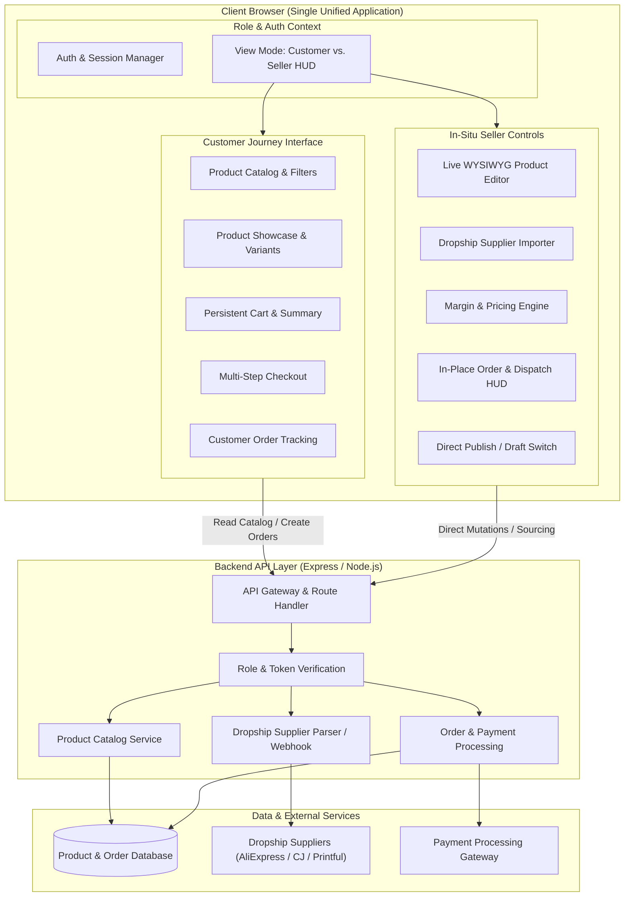
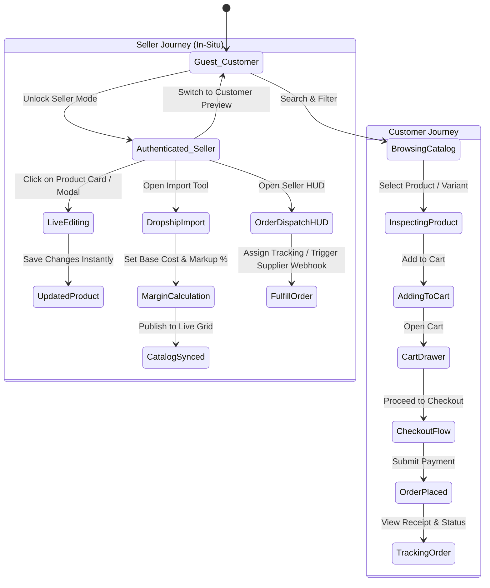
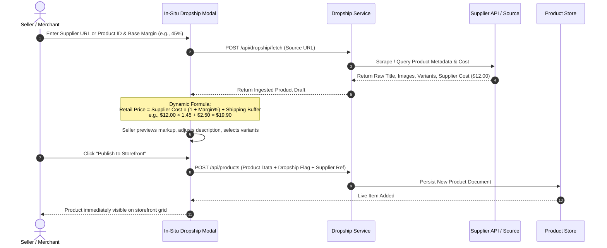
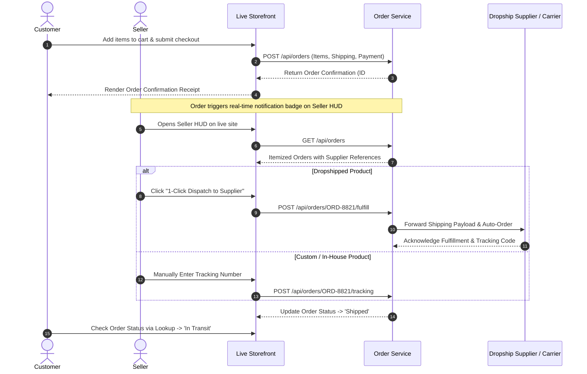

# System Architecture & Diagrams

This document details the architectural blueprints, data flows, component structures, and state management models for the **Dual-Journey In-Situ E-Commerce Platform**.

---

## 1. High-Level System Architecture



---

## 2. In-Situ UI Component Hierarchy

The UI structure avoids detached routing by wrapping live components in role-aware operational decorators.

```
App Root
├── RoleAuthProvider
├── StorefrontHeader
│   ├── Brand & Search Bar
│   ├── Category Navigation
│   ├── Cart Trigger Badge
│   └── Seller Mode Toggle / Profile Status
├── Main Storefront Canvas
│   ├── Banner / Featured Collection
│   ├── Filter & Sort Toolbar
│   ├── Product Grid (Dynamic Render)
│   │   ├── Customer Product Card (Hover zoom, Quick Add, Variant Picker)
│   │   ├── [Seller Mode] Inline Edit Overlay (Title, Price, Stock, Publish Status)
│   │   └── [Seller Mode] "Add New / Dropship Import" Action Card
├── Slide-out Panels & Overlays
│   ├── Product Detail Modal (With Customer Selector & Seller In-Place Edit)
│   ├── Cart & Checkout Drawer
│   ├── Customer Order Confirmation & Receipt View
│   ├── [Seller Mode] Dropship Import & Markup Config Modal
│   └── [Seller Mode] In-Place Order & Dispatch Management HUD
└── Storefront Footer
```

---

## 3. Dual-Journey Role-Based State Flow



---

## 4. Dropshipping Ingestion & Pricing Calculation Pipeline

When an authorized seller imports a dropshipped product, the ingestion pipeline automatically computes retail prices and margins based on configurable formula rules.



---

## 5. Order Processing & Fulfillment Flow



---

## 6. Data Model & Schema Structure

```
+-------------------------------------------------------------------+
|                            Product                                |
+-------------------------------------------------------------------+
| id: string (UUID)                                                 |
| title: string                                                     |
| description: string (Markdown supported)                          |
| category: string                                                  |
| tags: string[]                                                    |
| images: string[]                                                  |
| price: number                                                     |
| compareAtPrice: number | null                                     |
| costPrice: number (Seller visible only)                           |
| isDropshipped: boolean                                            |
| dropshipDetails: {                                                |
|   supplierName: string,                                           |
|   supplierSku: string,                                            |
|   supplierUrl: string,                                            |
|   markupPercentage: number                                        |
| } | null                                                          |
| inventory: number                                                 |
| status: "published" | "draft" | "archived"                        |
| variants: [                                                       |
|   { id: string, name: string, priceOffset: number, stock: number }|
| ]                                                                 |
| createdAt: timestamp                                              |
| updatedAt: timestamp                                              |
+-------------------------------------------------------------------+
                                  | 1
                                  | 
                                  | N
+-------------------------------------------------------------------+
|                           OrderItem                               |
+-------------------------------------------------------------------+
| productId: string (Ref Product)                                   |
| productTitle: string                                              |
| variantId: string | null                                          |
| variantName: string | null                                        |
| unitPrice: number                                                 |
| quantity: number                                                  |
| subtotal: number                                                  |
| isDropshipped: boolean                                            |
| supplierSku: string | null                                        |
+-------------------------------------------------------------------+
                                  | N
                                  |
                                  | 1
+-------------------------------------------------------------------+
|                             Order                                 |
+-------------------------------------------------------------------+
| id: string (e.g. "ORD-9281")                                      |
| customerEmail: string                                             |
| customerName: string                                              |
| shippingAddress: {                                                |
|   street: string, city: string, state: string, zip: string, country|
| }                                                                 |
| items: OrderItem[]                                                |
| pricing: {                                                        |
|   subtotal: number, shipping: number, tax: number, total: number   |
| }                                                                 |
| status: "pending" | "processing" | "shipped" | "delivered"        |
| trackingNumber: string | null                                     |
| fulfillmentMethod: "manual" | "dropship_auto"                     |
| createdAt: timestamp                                              |
+-------------------------------------------------------------------+
```
